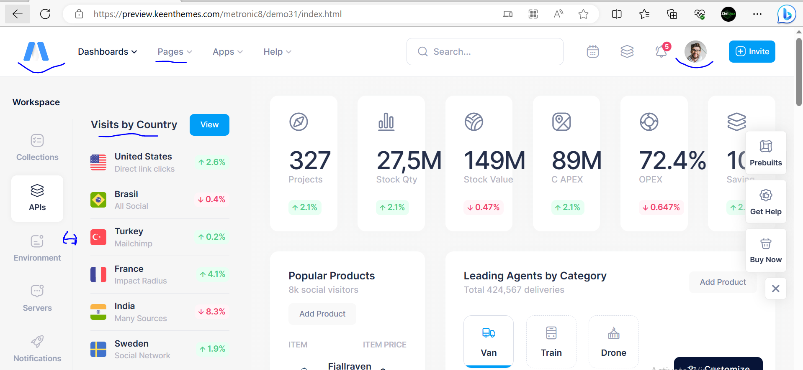
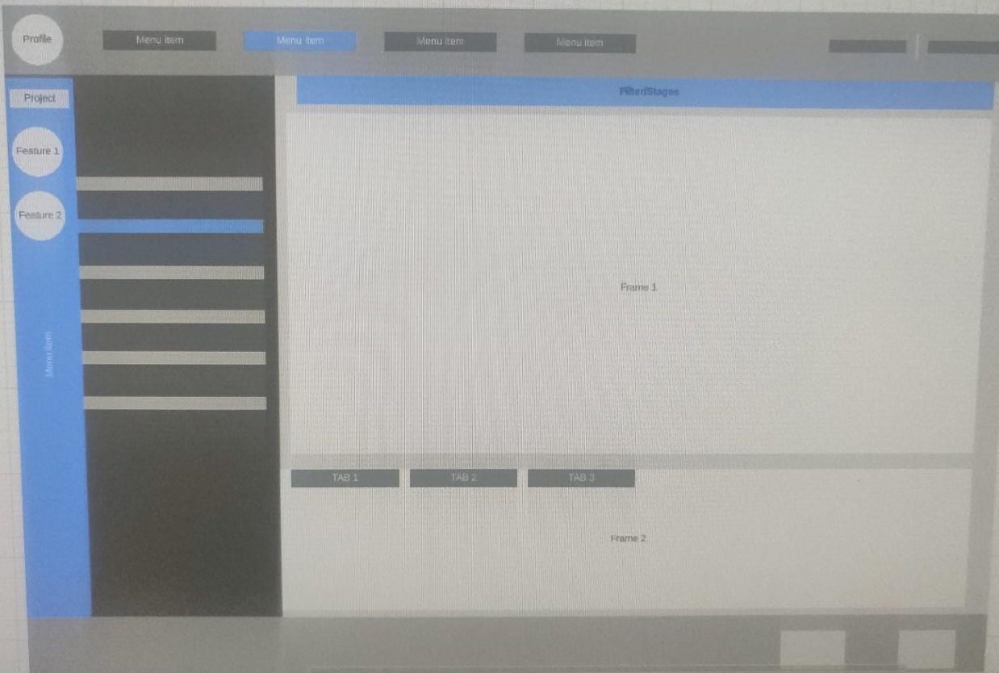

# Task Details
Please build a Dummy Dashboard similar to below Layout image. This task is more frontend task to test your skills on HTML, CSS(or Tailwind CSS Lib), Javascript, DHTML and 
Svelte.

This task is more about "Svelte" frontend.

 But to get the work done you require below items:
 
 - [Common General Dev Setup/Tools and Url's](README.md)

 - Required - Git, Visual Studio Code IDE(has inbuild git), installation instructions are available at [Frontend Svelte Installation](docs/README.Frontend.Svelte.md) file.
 
 - Optional - Incase you want to integrate Backend then install Composer(Laravel Package Manager), Laravel(PHP Framework),XAMPP setup and installation instructions are available at [Backend Installation](docs/README.Backend.md) file.

Below is the Dashboard that you need to build using Svelte.

1. Extreme Left hand side the blue column will be having Different Product option(circles or image) for selection.
2. Once you click on Option(circle or image) then it will open foldable Column(Grey/Black color Menu) and it will be having further links to choose from. Grey/Blue lines in foldable menu are just links.
3. Center page can have any Frame to have simple text to data coming from different sources and usually the main body part.
4. Top row contains various URLS. Like Extreme left circle is User Profile Icon and once you select then user should get logout, Profile Details edit options.
5. Just below top row there is another row having various filters like Pagination to move in between pages etc.
6. Bottom Row will be having Cancel and Save button.

HINT: Reference to Metronics Layout template will give you some hint about the layout names.[Marketting Automation Layout Template](https://preview.keenthemes.com/metronic8/demo31/index.html) resembles the layout that we are expecting here with some minor differences so you can use reference to complete your task. [Marketting Dashboard Layout image in references folder](references/Metrnoics-Marketting-Layout.PNG)

# Layout Example for Task

Above is just a Webwire frame or looklike example and you can refer similar Dashboard/Layout example using Metronics that we have mentioned below. It is just for your understanding building.

Incase, you are new to Backend, Frontend, Full Stack or unclear about how each component will stitch then below architecture diagram will help you to understand about the place in the Web interface where your Task work fit in big picture of the project. So we want you to code Frontend components colored in Orange. You can ignore svelte-plugin backend part as of now.

# Acceptance Criteria
Ideally, we would like to see similar Dummy Dashboard available on dashboard.

# Notes
1. We have given details about how to setup your laptop with required tools in README.md file.
2. You can use Youtube and other referenced sites do get this task done.
3. You can also use your friends to get this done but make sure you should be able to answer each and everything coded in it.
4. It is kind of Open Book format exam.

# How to sumbit
Once done then please submit your code back into branch name 'interview/xyz'

# Duration for Completion
You are having a week of time from the date of receving the test in your inbox.

NOTE: Your access will be revoked after that so make sure you upload your code before that.

# Hint
 - Tailwind - It gives you prebuilt Button, Text boxes, Classes etc so you can pick reference code from this website while working with LiveWire.
 
 - Metronics - This webpage will give you various types of Layout designs and their names so that you can further google to find examples to complete your tasks.

 - Setup - Usually, it takes 30Min to setup everything after reading all given installation steps.

 - frontend-example-code - Working frontend-example-code is available so that you can focus on layout logic.Please install your setup instead of using this to avoid any issue.

# Result
Incase, we not revert you back then there are chances that we have found suitable condiate or else you will get to know about your selection in next 7 days after completion of the test.

# Interview Tasks
[1. Svelte Frontend Task(Compulsory)](TASK-1-Frontend.md)

[2. DevOps Task (Optional)](TASK-2-DevOps.md)

[3. Create Dockerfile for Frontend (Optional) ](TASK-3-Dockerfile.md)

# References
- [Understand Frontend & Backend Integration Architecture](docs/README.Fullstack-Stack-Tool.md)

Best of luck!

Thanks & Regards,

Zielbox Interview Team

[www.zielbox.com](http://www.zielbox.com)