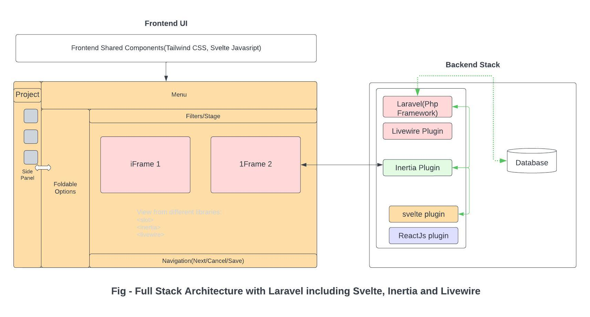

# Introduction
Full stack includes both Front end and Backend technologies or the glue plugins in between these two areas that helps in seamless integration and are like AJAX, Inertia,API's etc.

# Full Stack Architecture Understanding
Below Architecture diagram shows various well known frameworks or language that we are using to build our project.

# Frontend 
 - [Understand Svelte Front end](README.Frontend.Svelte.md)

# Backend
 - [Understand Laravel Backend end](README.Backend.md)

# Full stack Learning References
- [General Learning URL's](../README.md)

